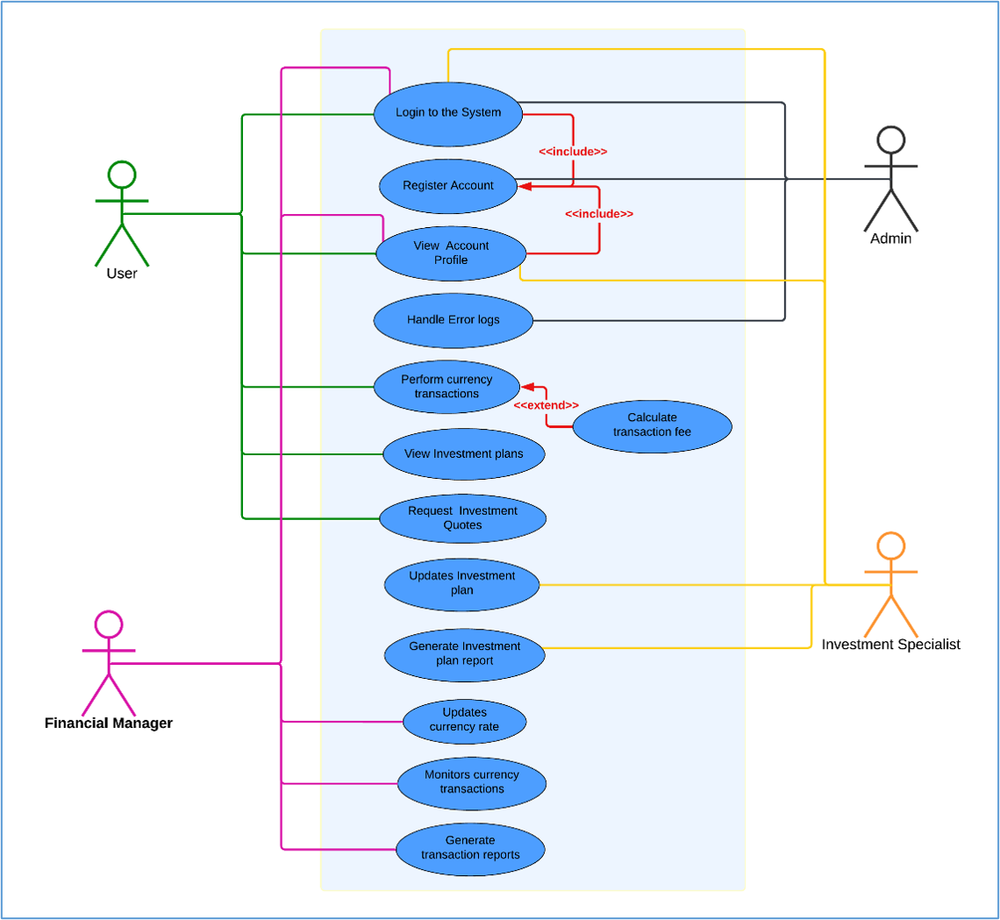
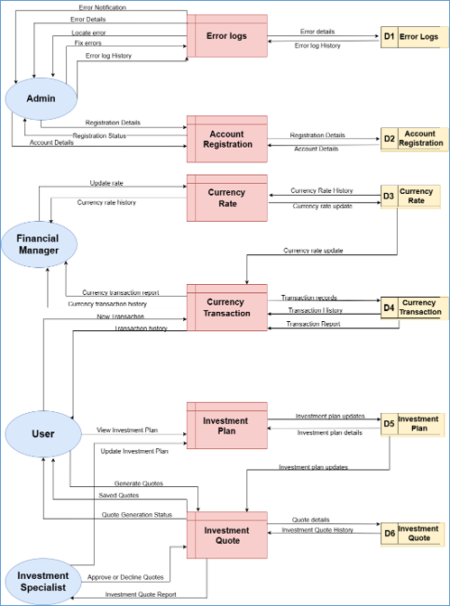
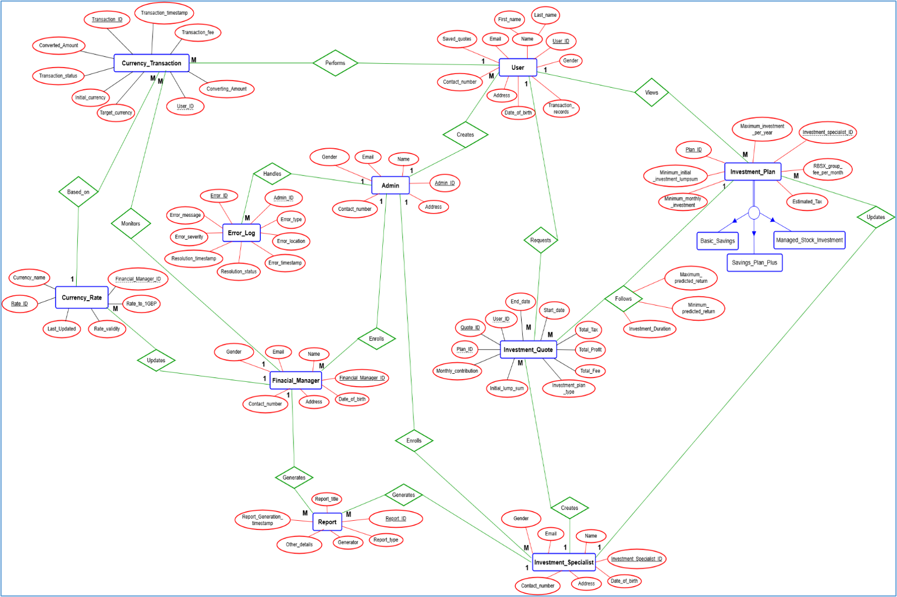
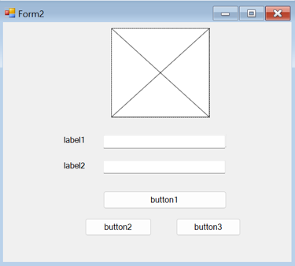

# Enomy-Finances Systems Analysis & SDLC Case Study

## Enomy-Finances Systems Analysis Portfolio

**Focus:** Systems Analysis • SDLC Planning • Feasibility Analysis • UML Modelling • Wireframing • Interface Design • Risk Management • Solution Evaluation

This repository presents a complete systems analysis and design case study for the Enomy-Finances project, demonstrating the planning and analytical work carried out across the Software Development Life Cycle.

A comprehensive systems analysis and project planning case study for a financial services platform designed to support currency conversion, savings and investment services, client data management, and administrative operations.

## Project Type

Systems Analysis | SDLC Planning | Requirements Engineering | Feasibility Analysis | UML Modelling | Wireframing | UI/UX Planning

> This repository focuses on the planning, analysis, modelling, and design stages of the Software Development Life Cycle rather than source-code implementation.

## Project Status

**Status:** Completed

This repository documents the completed analysis, planning, modelling, wireframing, interface design, review, and evaluation stages of the Enomy-Finances project.

The focus of this repository is on systems analysis and project planning rather than source-code implementation.

## Project Overview

Enomy-Finances is a financial services organisation that provides services related to mortgages, savings, investments, budgeting, and financial planning.

The organisation required a new computer system to support both staff and clients while improving accessibility, security, scalability, and usability.

The proposed system includes:

- Currency conversion functionality
- Savings and investment quotation tools
- Secure storage of client information
- Transaction and quote history
- Role-based access for different users
- Error logging and system monitoring
- Web-based accessibility
- Financial data presentation through textual, numerical, and graphical formats

## My Role & Responsibilities

For this project, I carried out the systems analysis, planning, and design activities required to investigate and propose a solution for the Enomy-Finances system.

My responsibilities included:

- Defining the project scope and objectives
- Identifying business, user, and system requirements
- Evaluating system investigation methods
- Comparing SDLC models and selecting an appropriate approach
- Conducting feasibility analysis
- Identifying project risks and mitigation strategies
- Creating UML and behavioural system models
- Producing Data Flow Diagrams and Entity Relationship Diagrams
- Designing wireframes and role-based user interfaces
- Reviewing feedback and refining the proposed designs
- Evaluating security, maintainability, and software quality considerations
- Assessing requirements traceability and future improvements
- Producing comprehensive project documentation

## Key Deliverables

The project produced the following analysis and design deliverables:

- Project scope and objectives
- User and system requirements
- System investigation analysis
- SDLC model comparison and selection
- Feasibility study
- Risk analysis and mitigation strategies
- Use Case Diagrams
- Activity Diagrams
- Data Flow Diagrams
- Finite State Machine and Extended FSM
- Entity Relationship Diagram
- Wireframes
- Role-based interface designs
- Design feedback and refinement
- Security and maintainability evaluation
- Requirements traceability
- Final solution evaluation
- Future recommendations
  
## Skills Demonstrated

This project demonstrates experience in:

- Systems analysis
- Software Development Life Cycle planning
- Requirements gathering and analysis
- Functional and non-functional requirements
- Feasibility analysis
- Risk identification and mitigation
- SDLC model evaluation
- Stakeholder analysis
- UML modelling
- Use Case diagrams
- Activity diagrams
- Data Flow Diagrams
- Entity Relationship Diagrams
- Finite State Machines
- Wireframing
- Interface design
- Security and maintainability planning
- Design feedback and refinement
- Requirements traceability
- Solution evaluation
- Technical documentation

## Project Highlights

### System Modelling

#### Use Case Diagram

#### Data Flow Diagram

#### Entity Relationship Diagram

### Wireframing

### Interface Design

## Project Documentation

Explore the project by section:

- [01 - Project Scope](./01-project-scope/)
- [02 - System Investigation](./02-system-investigation/)
- [03 - SDLC Analysis](./03-sdlc-analysis/)
- [04 - Feasibility Study](./04-feasibility-study/)
- [05 - System Design](./05-system-design/)
- [06 - Wireframes](./06-wireframes/)
- [07 - Interface Designs](./07-interface-designs/)
- [08 - Design Review & Feedback](./08-design-review/)
- [09 - Final Evaluation](./09-evaluation/)

## Full Report

The complete project report is available here:

[View Enomy-Finances Systems Analysis Report](./Enomy-Finances-Systems-Analysis-Report.pdf)
